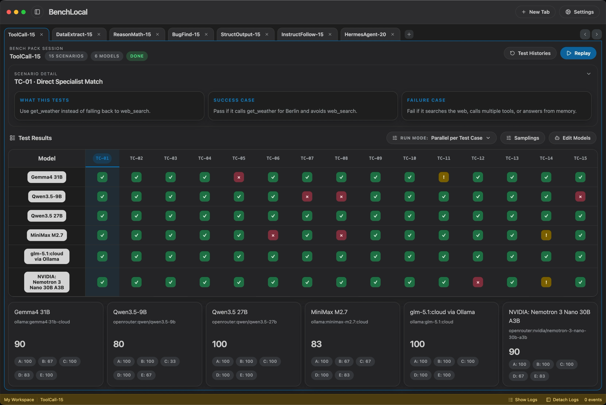

  

<h1 align="center">BenchLocal</h1>

  Test LLMs on real tasks. Compare models side-by-side.

  <a href="https://benchlocal.com">Website</a>
  ·
  <a href="https://github.com/stevibe/BenchLocal/releases/latest">Download</a>
  ·
  <a href="./docs/assets/benchlocal-demo.mp4">Watch demo</a>
  ·
  <a href="./BENCH_PACK_AUTHORING.md">Build a Bench Pack</a>

  

BenchLocal is a local-first desktop app for running, comparing, and managing installable LLM Bench Packs against local or remote models.

Official Bench Packs today:

- [ToolCall-15](https://github.com/stevibe/ToolCall-15)
- [BugFind-15](https://github.com/stevibe/BugFind-15)
- [DataExtract-15](https://github.com/stevibe/DataExtract-15)
- [InstructFollow-15](https://github.com/stevibe/InstructFollow-15)
- [ReasonMath-15](https://github.com/stevibe/ReasonMath-15)
- [StructOutput-15](https://github.com/stevibe/StructOutput-15)
- [CLI-40](https://github.com/stevibe/CLI-40)
- [HermesAgent-20](https://github.com/stevibe/HermesAgent-20)

BenchLocal owns the shared desktop runtime:

- provider configuration
- model registry
- Bench Pack install and update flow
- per-tab sampling overrides
- run execution and result history
- verifier lifecycle management
- persisted desktop UI state

## Agent access

BenchLocal can expose a local agent surface so AI agents and automation tools can control benchmark workflows while the desktop UI stays live.

Enable it from **Settings > Agent Access**. The app will show:

- a bearer token
- the local Agent Guide URL
- the OpenAPI URL
- the MCP Streamable HTTP URL

The HTTP API uses JSON commands for actions such as listing Bench Packs, managing providers and models, creating tabs, selecting models, refreshing availability, starting runs, resuming runs, retrying results, and stopping active runs. Live progress is available through Server-Sent Events at `/v1/events`.

MCP-capable agents can connect to `/mcp` with the same bearer token and use standard `benchlocal_*` tools plus BenchLocal state resources. This is the preferred integration path for agents that support tool calls.

See [docs/agent-control-api.md](./docs/agent-control-api.md) for endpoint details, MCP tools/resources, safety rules, and the extension checklist for adding future UI features to the agent surface.

Each Bench Pack owns its benchmark behavior:

- scenario definitions
- benchmark-specific prompts
- scoring logic
- verifier contracts where required
- benchmark-specific traces and summaries

## Repo layout

- `app/`
  Electron app shell, desktop UI, main process, preload, renderer
- `packages/benchlocal-core`
  shared protocol, config, workspace, and theme types
- `packages/benchlocal-sdk`
  authoring helpers for Bench Pack repos
- `packages/benchpack-host`
  host-side install, inspection, verifier, and run orchestration logic
- `themes/`
  built-in desktop themes
- `scripts/`
  local macOS release helpers
- `docs/`
  packaging and release docs

## Developer references

- [ARCHITECTURE.md](./ARCHITECTURE.md)
- [BENCH_PACK_AUTHORING.md](./BENCH_PACK_AUTHORING.md)
- [BENCH_PROTOCOL_V1.md](./BENCH_PROTOCOL_V1.md)
- [CONFIG_SCHEMA_V1.md](./CONFIG_SCHEMA_V1.md)
- [BENCHLOCAL_REGISTRY_V1.md](./BENCHLOCAL_REGISTRY_V1.md)
- [docs/agent-control-api.md](./docs/agent-control-api.md)
- [docs/macos-release.md](./docs/macos-release.md)
- [docs/windows-release.md](./docs/windows-release.md)
- [docs/linux-release.md](./docs/linux-release.md)

## Build commands

- `npm run build`
  compile the app and workspace packages for development
- `npm run pack`
  compile and package the production desktop app, including DMG and ZIP artifacts
- `npm run build:dir`
  compile and produce an unpacked local app bundle
- `npm run build:win`
  compile and package unsigned Windows NSIS and ZIP artifacts
- `npm run build:linux`
  compile and package Linux AppImage and tar.gz artifacts
- `npm run release:all`
  build the signed macOS release plus Windows and Linux desktop artifacts in one command

## License

MIT
